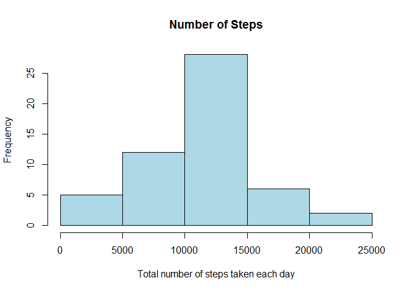
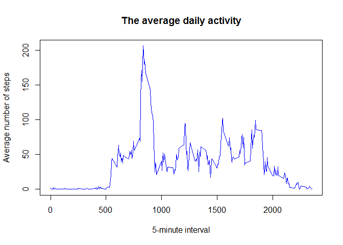
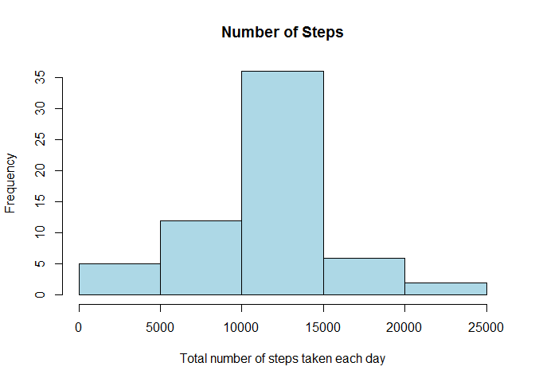
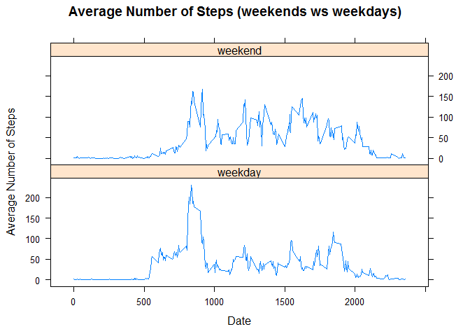

# Reproducible Research: Peer Assessment 1
Pasi Hyytiäinen  


## Introduction

This assignment makes use of data from a personal activity monitoring
device. This device collects data at 5 minute intervals through out the
day. The data consists of two months of data from an anonymous
individual collected during the months of October and November, 2012
and include the number of steps taken in 5 minute intervals each day.

     
## Data
The data for this assignment can be downloaded from the course web
site:

* Dataset: [Activity monitoring data](https://d396qusza40orc.cloudfront.net/repdata%2Fdata%2Factivity.zip) [52K]

The variables included in this dataset are:

* **steps**: Number of steps taking in a 5-minute interval (missing
    values are coded as `NA`)

* **date**: The date on which the measurement was taken in YYYY-MM-DD
    format

* **interval**: Identifier for the 5-minute interval in which
    measurement was taken


The dataset is stored in a comma-separated-value (CSV) file and there
are a total of 17,568 observations in this
dataset.

     
## Loading and preprocessing the data
  

```r
# download the data if needed
datafile="activity.zip"
if(!file.exists(datafile)){
        source_url="http://d396qusza40orc.cloudfront.net/repdata%2Fdata%2Factivity.zip"
        download.file(source_url,destfile=datafile,method="internal")        
}

# unzip and read the file
unzip(datafile)
activities <- read.csv("activity.csv")

# try to convert date column data to date class values
activities$date<-as.Date(activities$date, format = "%Y-%m-%d")
```

     
## What is mean total number of steps taken per day?

The histogram of the steps by day (NA values are ingnored).

```r
library(plyr)

activitiesCleaned <- activities[which(activities$steps != "NA"), ]

totalStepsByDay<-ddply(activitiesCleaned, .(date), summarise, steps=sum(steps))


names(totalStepsByDay) <- c("date", "total_steps")

hist(totalStepsByDay$total_steps, main="Number of Steps", 
     xlab="Total number of steps taken each day", col="light blue")
```

 

Mean and median for total number of steps taken per day:

```r
noNAMean<-mean(totalStepsByDay$total_steps)
noNAMedian<-median(totalStepsByDay$total_steps)

paste("Mean  =",round(noNAMean,2),"steps by day")
```

```
## [1] "Mean  = 10766.19 steps by day"
```

```r
paste("Median =",round(noNAMedian,2),"steps by day")
```

```
## [1] "Median = 10765 steps by day"
```


     
## What is the average daily activity pattern?

Here is the time series plot of the 5-minute interval (x-axis) and the average number of steps taken, averaged across all days

```r
stepsInterval <- ddply(activitiesCleaned, .(interval), summarise, steps=mean(steps))

#stepsInterval <- aggregate(steps ~ interval, data=activities, FUN=mean)
plot(stepsInterval$interval,
     stepsInterval$steps, 
     type="l",
     col="blue",
     xlab="5-minute interval", 
     ylab="Average number of steps",
     main="The average daily activity")
```

 

Which 5-minute interval, on average across all the days in the dataset, contains the maximum number of steps?

```r
maxIndex<-which.max(stepsInterval$steps)
val<-stepsInterval[maxIndex,]
paste("The interval",val$interval[1],"has the maximum average of steps",round(val$steps[1],0))
```

```
## [1] "The interval 835 has the maximum average of steps 206"
```

     
## Imputing missing values


```r
missingValues <- sum(is.na(activities))
```

Total number of missing values in the dataset (i.e. the total number of rows with `NA`s) : 2304

As there are a number of days/intervals where there are missing values (coded as `NA`), the presence of missing days may introduce bias into some calculations or summaries of the data.

**Note!** Here I will assume that the activities usually follow a daily pattern.
So `NA's` are replaced with the mean value at the same interval across days.


```r
dataMerge<-merge(activities,stepsInterval,by.x="interval",by.y="interval")
nas <- is.na(dataMerge$steps.x)
dataMerge$steps.x[nas] <- dataMerge$steps.y[nas]
dataMerge <- dataMerge[,c(1:3)]
```

The histogram of the steps by day when NA values are replaced with the mean value at the same interval across days.

```r
dataMerge2 <- aggregate(steps.x ~ date, data = dataMerge, FUN=sum, na.rm=TRUE)
names(dataMerge2) <- c("date", "total_steps")

hist(dataMerge2$total_steps, main="Number of Steps", 
     xlab="Total number of steps taken each day", col="light blue")
```

 

Mean and median for total number of steps taken per day:

```r
replacedNAMean<-mean(dataMerge2$total_steps)
replacedNAMedian<-median(dataMerge2$total_steps)

paste("The new mean is",round(replacedNAMean,2),"steps by day")
```

```
## [1] "The new mean is 10766.19 steps by day"
```

```r
paste("The new median is",round(replacedNAMedian,2),"steps by day")
```

```
## [1] "The new median is 10766.19 steps by day"
```

The difference between the new and old mean/median are:

```r
paste("Mean Old - Mean New =",round(noNAMean-replacedNAMean,2))
```

```
## [1] "Mean Old - Mean New = 0"
```

```r
paste("Median Old - Median New =",round(noNAMedian-replacedNAMedian,2))
```

```
## [1] "Median Old - Median New = -1.19"
```

Mean values didn't change as expected as the  total averge were not changed.
Median value changed as expected.

     
## Are there differences in activity patterns between weekdays and weekends?

Add a new column to the dataset,  with two levels – “weekday” and “weekend” indicating whether a given date is a weekday or weekend day. 

```r
## if you are not running in "English", you need to change the LC_TIME to correct value
Sys.setlocale("LC_TIME", "English")
```

```
## [1] "English_United States.1252"
```

```r
## note POXIXlt wday
## 0–6 day of the week, starting on Sunday
dataMerge$day=ifelse(as.POSIXlt(as.Date(dataMerge$date))$wday %%6==0,
                          "weekend","weekday")
```


Here's a time series plot of the 5-minute interval and the average number of steps taken, averaged across all weekday days or weekend days.


```r
dataMerge3 <- ddply(dataMerge, .(interval, day), summarise, steps=mean(steps.x))


library(lattice)
xyplot(steps~interval|day,
       data=dataMerge3,
       layout = c(1, 2),
       type="l",
       ylab = "Average Number of Steps",
       xlab = "Date",
       main = "Average Number of Steps (weekends ws weekdays)")
```

 

It can be seen that activity on the weekends looks like to be more spread out over the day compared to the weekdays. Maybe because activities on weekdays follow a work related routine, whereas weekends could be more random. 

